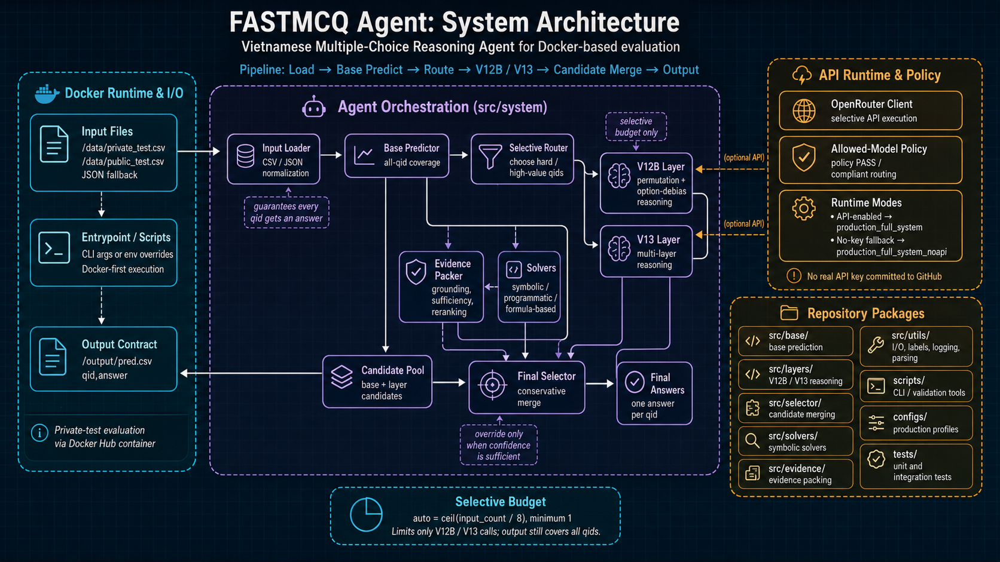

# FASTMCQ Agent

<div align="center">

### Vietnamese Multiple-Choice Reasoning Agent for Student HackAIthon 2026

Docker-first MCQ answering system for the BTC private-test evaluation.<br>
Reads `/data/private_test.csv` or `/data/public_test.csv`, runs a selective dynamic reasoning
pipeline, and writes `/output/pred.csv`.


</div>

## Table of Contents

- [Competition Context](#competition-context)
- [Official Docker Submission](#official-docker-submission)
- [Quick Start](#quick-start)
- [Input and Output Contract](#input-and-output-contract)
- [System Architecture](#system-architecture)
- [Runtime Modes](#runtime-modes)
- [Repository Structure](#repository-structure)
- [Validation](#validation)
- [Documentation](#documentation)
- [Security Notes](#security-notes)

## Competition Context

Built for the **Vietnamese Student HackAIthon 2026 / BTC** Docker-based evaluation. The
private-test round runs the submitted **Docker Hub container**: the harness mounts the dataset at
`/data`, the container answers each question, and it writes `pred.csv` to `/output`. The output
format is **`qid,answer`** — one answer per input question.

## Official Docker Submission

| Purpose | Image |
|---|---|
| Official submission image | `vquclinh/fastmcq-agent:latest` |
| Explicit API-enabled tag | `vquclinh/fastmcq-agent:api-baked` |
| Safe no-key fallback | `vquclinh/fastmcq-agent:no-key` |

`latest` is intended to point to the API-enabled `api-baked` image on Docker Hub for evaluation
convenience. **GitHub contains only the normal safe `Dockerfile`; no secret is committed.**

## Quick Start

```bash
mkdir -p data output

# Put private_test.csv or public_test.csv in ./data
docker run --rm \
  -v "$PWD/data:/data:ro" \
  -v "$PWD/output:/output" \
  vquclinh/fastmcq-agent:latest
```

Predictions are written to:

```text
output/pred.csv
```

## Input and Output Contract

**Input priority** (first match wins):

1. `/data/private_test.csv`
2. `/data/public_test.csv`
3. `/data/private_test.json`
4. `/data/public_test.json`

CLI overrides are supported (forwarded to the entrypoint):

```bash
--input /data/custom_input.csv --output /output/custom_pred.csv
```

(or the environment equivalents `-e INPUT_FILE=/data/custom_input.csv -e OUTPUT_FILE=/output/custom_pred.csv`.)

**Output:**

- File: `/output/pred.csv`
- Header: `qid,answer`
- `answer` is an option label such as `A`/`B`/`C`/`D`; the parser supports wider choice sets when
  the input provides more options.

## System Architecture

This is a **dynamic full-system reasoning agent**, not a single-shot baseline: a base predictor
guarantees full coverage, selective API reasoning layers (V12B / V13) target high-value
questions, and a conservative selector merges the candidates.

<div align="center">



</div>

### Modules

| Area | Package | Role |
|---|---|---|
| System Orchestration | `src/system/` | Full dynamic pipeline, production profiles, Docker-facing inference flow |
| Base Prediction | `src/base/` | Produces complete all-qid coverage before selective reasoning |
| Dynamic Layers | `src/layers/` | V12B/V13 selective reasoning, routing, permutation debiasing, least-to-most / content-first passes |
| API Runtime | `src/api/` | OpenRouter client, selective API execution, allowed-model policy integration |
| Final Selection | `src/selector/` | Candidate consistency, ranking, conservative override decisions |
| Solvers | `src/solvers/` | Symbolic/programmatic/formula-based MCQ solvers and heuristic reasoning |
| Evidence | `src/evidence/` | Evidence packing, reranking, sufficiency checks, option grounding |
| Utilities | `src/utils/` | Data I/O, label handling, output parsing, logging, postprocessing |

### Reasoning stages

| Stage | Coverage | Purpose |
|---|---:|---|
| Base Predictor | all qids | Guarantees every input question receives an answer |
| V12B | `ceil(N/8)` qids by default | Option-permutation reasoning to reduce ordering bias |
| V13 | `ceil(N/8)` qids by default | Multi-layer targeted reasoning: programmatic, content-first, least-to-most |
| Final Selector | all qids | Merges base/layer candidates and only overrides when confidence is sufficient |

The selective budget is **`auto = ceil(input_count / 8)`**, minimum 1 (e.g. 3 → 1, 463 → 58). It
limits only how many questions the V12B/V13 reasoning layers may call — the **output always
contains all input qids**.

### Design Principles

- **All-qid coverage first:** never rely on selective layers to produce complete output.
- **Selective reasoning budget:** reserve expensive API reasoning for high-value qids.
- **Permutation debiasing:** test answer stability across option orderings.
- **Conservative selection:** prefer safe overrides over noisy changes.
- **Docker-first reproducibility:** one command reads `/data` and writes `/output/pred.csv`.

See [`docs/METHOD.md`](docs/METHOD.md) for the full method description.

## Runtime Modes

| Mode | Trigger | Behavior |
|---|---|---|
| API-enabled | `OPENROUTER_API_KEY` present | runs `production_full_system` |
| No-key fallback | no key | runs `production_full_system_noapi`, still writes `pred.csv` |

Supply a key at run time to the safe image:

```bash
docker run --rm \
  -e OPENROUTER_API_KEY="$OPENROUTER_API_KEY" \
  -v "$PWD/data:/data:ro" \
  -v "$PWD/output:/output" \
  vquclinh/fastmcq-agent:no-key
```

- The official `latest` tag is intended to be **API-enabled**.
- The `no-key` tag exists for **safe reproducibility and offline fallback**.

## Repository Structure

```text
src/                    core inference system
  system/               full-system orchestration
  base/                 base predictors and solver factory
  layers/               V12B/V13 dynamic reasoning layers
  api/                  OpenRouter and selective API clients
  selector/             candidate merging and final selection
  solvers/              symbolic/programmatic MCQ solvers
  evidence/             evidence packing and reranking
  utils/                IO, labels, logging, parsing

scripts/                CLI/Docker entrypoints and validation tools
configs/                production profiles and model-policy configuration
tests/                  unit and integration tests
docs/METHOD.md          method description
DOCKER_SUBMISSION.md    Docker-specific submission details
docs/audits/            audit trail of major changes and validations
```

## Validation

```bash
.venv/bin/python -m compileall -q src scripts tests
.venv/bin/python -m pytest -q
.venv/bin/python scripts/audit_model_policy.py
```

- The Docker matrix has been tested for default I/O and explicit `--input`/`--output`.
- API-enabled mode has been tested against OpenRouter on a tiny input.
- Detailed logs are kept out of the repository; see `docs/audits/` for the validation trail.

## Documentation

- [DOCKER_SUBMISSION.md](DOCKER_SUBMISSION.md) — Docker build/run details and the I/O contract.
- [docs/METHOD.md](docs/METHOD.md) — method and architecture description.
- [docs/audits/](docs/audits/) — audit trail of major changes and validations.

## Security Notes

- **No real API key is committed to GitHub.**
- `.env` is git-ignored.
- `Dockerfile.api` (the API-baked build) is **local-only and git-ignored** — it is never part of
  the committed repository.
- The API-enabled Docker Hub image may contain a **disposable** contest key baked in for
  evaluation convenience; that secret lives only in the image layer, never in GitHub.
- **Revoke the key after evaluation.**

---

<div align="center">

Prepared for the Vietnamese Student HackAIthon 2026 / BTC Docker-based evaluation.

</div>
